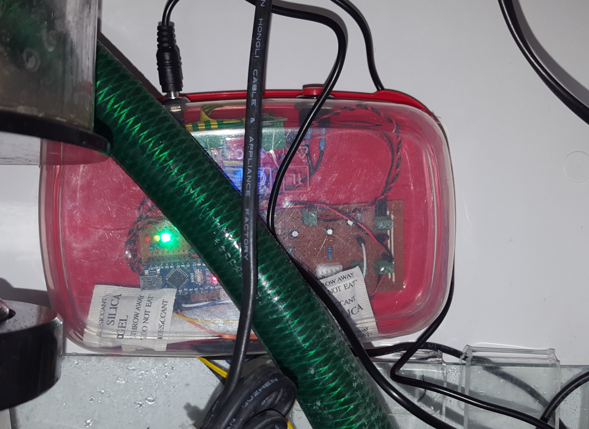
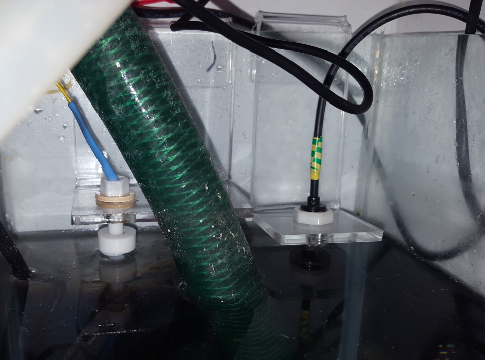
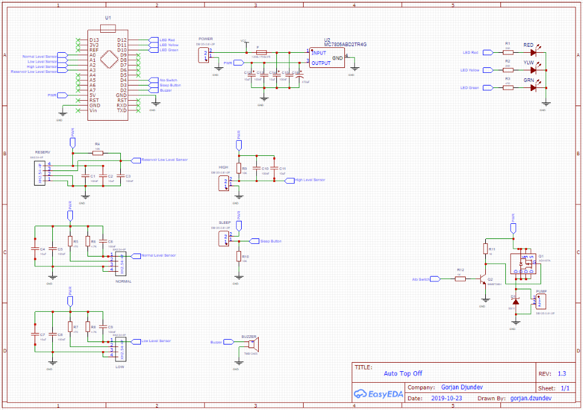
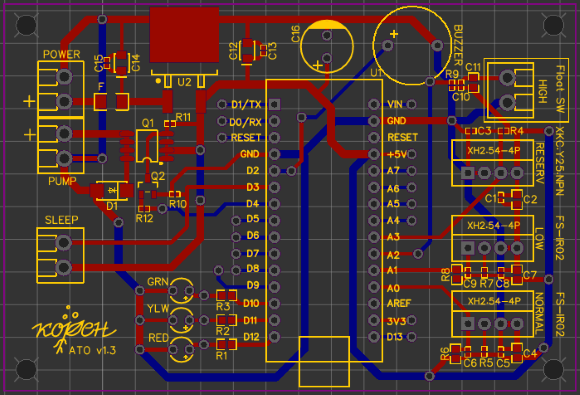

# Auto Top Off Station (ATO)

## Features
- up to four liquid level sensors: 
    - **normal level sensor (mandatory)**; Placed where the desired water level should be. Signals when to start/stop dispensing.
    - **high level sensor (optional)**; Backup sensor when the water level goes above the normal sensor. 
    Will raise an alarm and stop the water dispenser when sensing water.
    - **low level sensor (optional)**; Backup sensor when the water level is below the normal level; Will raise an alarm when not sensing water.
    - **reservoir low sensor (optional)**; Will raise an alarm and stop the water dispenser when not sensing water.
- 3 mechanisms against flood:
    - the normal level sensor signals to stop the water dispenser.
    - predefined max dispensing period, when water dispensing lasts longer than this period, the dispensing will stop and an alarm will be raised.
    - high level sensor to trigger an alarm and signal to stop the dispenser if the water level has gone too far above the normal level sensor.
- sleep mode:
    - the ATO will go to sleep for predefined duration when the sleep button is released after pressing it for more than 3 seconds.
    - the ATO will automatically stop sleeping after the predefined sleep duration.
    - the ATO will stop sleeping when the sleep button is released after pressing it for less than 3 seconds.
    - the sleep button has a debounce against accidental very short clicks.
    - the ATO will acknowledge all alarms when going to sleep.
- state indication with three led indicators:
    - blinking green: the ATO is sensing for water level changes when the water level is at the desired level.
    - continuous green: the ATO water dispenser is `ON`
    - blinking yellow: the ATO is sleeping
    - blinking red: the ATO has raised alarms, and will not dispense until alarms are cleared. 
- state indication with sound; 
    - the Alarm station will sound an alarm with different duration (seconds) for each severity (`Critical`, `Major`, `Minor`, and `NoSeverity`).
    - the Alarm station will repeat the sound notification after a predefined period (minutes) for that type of severity.
- auto acknowledge alarms:
    - auto acknowledge `AtoTopOffFailed` alarm when user manually corrects the water level and normal level sensor is sensing water.
    - auto acknowledge `AtoHighLevel` alarm when user drains the excess water, and the high level sensor no longer senses water.
    - auto acknowledge `AtoLowLevel` alarm when user re-fills missing water, and the low level sensor starts sensing water.
    - auto acknowledge `AtoReservoirLow` alarm when user re-fills depleted water in the reservoir. 
- auto reset
    - the ATO will reset when it fails to complete all tasks in less than two seconds.
    - the ATO will continue with normal operation after the reset. 

## Software `main.cpp()`

### Hardware connections with the micro controller
Hardware connections are specified in the `McuPin` name-space. This is the only place where hardware connection changes should be reflected in the software.

### ATO minimum dispensing interval
After successful water dispense the ATO will not dispense again until the minimum dispensing period is over. After this period has passed, the ATO will use
the level sensor readings to decide if it should dispense more water, or wait for change of the water level readings. Adjust this period by setting the
`AtoSettings::minDispensingIntervalMs` variable. Default value is 15 minutes expressed in milli-seconds.

### ATO maximum dispensing duration
As a precaution against flooding, the ATO dispensing duration is limited to no more than a predefined duration. 
Adjust this duration by setting the `AtoSettings::maxDispensingDurationMs` variable. Default value is 90 seconds expressed in milli-seconds.
     
### Not implemented Hardware
The software is modular and decoupled; any missing hardware can simply be commented out. Look at the comments in `main.cpp`.  

### Alarm sound notifications
Alarm sound notifications are specified in the `setup()` method.
- alarm sound duration for each severity (seconds)
- alarm repeat period for each severity (minutes)

### Setup and Loop
- `main::setup::AbstractRunnable::setupAll()` will call the `setup()` method of every instantiated runnable object. 
- `main::loop::AbstractRunnable::loopAll()` will call the `loop()` method of every instantiated runnable object. 

## Hardware
There's more than one way to skin a cat. Here is a device under test: 
[AutoTopOff 191023A at EasyEDA](https://easyeda.com/editor#id=|fa8bb0e04d9b4fc78f990129cddcddab|593dde0f6dfb49ab90fe58fdcb36cdab|d662643e46e24f88a0c42d26cf0ab7b5)
#### Device Under Test

#### Sensors

### Next Hardware Development
#### Schematics

#### PCB
